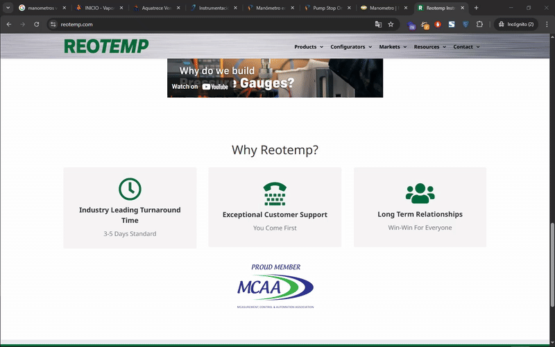
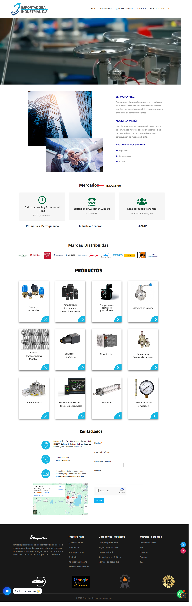
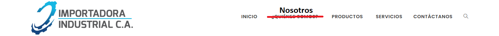

El dia de hoy lunes 19/05 se ha logrado tener el primer meeting oficial acerca de como seria la nueva version del website de ESTEIN. 

[Dimuca](https://dimuca.net)

Este sitio web usa los siguientes stacks 

Es decir que los stacks principales son:
- Wordpress
- Woocomerce
- Elementor

#### Secciones Homepage 
- Background Image (Con un button para redireccionar a un modulo)
- Quienes somos
- Nuestas Marcas 
- Nuestros Productos 
- Aliados Comerciales 
- Contact (With form)

---

Por tanto tras una reunion el dia de hoy lunes 19 de mayo, se ha abordado completamente el punto de la pagina web, la cual realizando un query en Google se ha buscado websites de empresas en Venezuela que vendan manometros y estos fueron los findings:

#### Query 1: manometros venta
https://www.google.com/search?q=manometros+venta&sca_esv=5343c4de10c8fdae&rlz=1C1GCEU_esVE1160US1160&ei=dVkraI7dMI6dwbkP3LzwuAo&start=30&sa=N&sstk=Af40H4XmgjcRzC2p_AVsfSBKoJnM7kI-XYXw8DVq0c_U7bKd1y1gtOnWyD-8cf8o6rWL-yjfukek0ehV29bC3J-WUHDAwpvhaYRfwvhj0-v_dFgQtI57RdFLKb1TSkBOzrL7oa7tzDY2L_N8F6zu2s9Gp93D1zTR7Uo&ved=2ahUKEwjO67au96-NAxWOTjABHVweHKc4FBDw0wN6BAgJEBc&biw=1440&bih=811&dpr=1

[VaportTec](https://vaportec.com.ve/product-category/instrumentacion/manometros/)

Este sitio web usa los siguientes stacks 

Es decir que los stacks principales son:
* Wordpress
* Woocomerce
* Elementor

#### Secciones Homepage 
- Background Image (With a text)
- Marcas Distribuidas 
- Nuestros Servicios 
- Quienes Somos
- Tienda Online 
- Cursos 
- Feedback
- Blog 
- Clientes (Carousel)
- Contacto

Nota: Todas las secciones se armaron con Elementor

---

[AquaTrece](https://aquatrece.com/products-details/pg-lf-lm-m/manometro)

Este sitio web usa los siguientes stacks 

Es decir que los stacks principales son:
- Javascript (Algun framework de JS de frontend)

#### Secciones Homepage 
- Video Background
- Tipo de Industria
- Productos (Card de productos [No de Categoria])
- Categorias
- Aliados 
- About (Un fragmento de esa seccion)
- Suscripcion Newsletter

En este website en particular lo que agrada es que en la seccion del homepage aparece un video y se quiere hacer la misma implementacion en el website de ESTEIN en el modulo de home, cuando la pagina se ve por primera vez.

---

[Importadora Industrial C.A.](https://importadoraindustrial.com/categoria-producto/instrumentacion-y-medicion/)

Este sitio web usa los siguientes stacks

Es decir que los stacks principales son:
- Wordpress
- Woocomerce
- Elementor

#### Secciones Homepage
- Imagen Background
- Quienes somos
- Representantes
- Contacto Boton

De este website en particular lo que agrada son los siguientes elementos:

#### Navbar 

Es decir que dentro del navbar de la nueva version de ESTEIN tendran los siguientes modulos:
- Inicio 
- About (¿Quienes Somos?)
- Productos (Tienda)
- Servicios 
- Contacto

#### Modulo Productos

https://importadoraindustrial.com/productos/

Lo que agrada de este modulo es que los productos se asocian a una categoria y por tanto se pretenden agregar las siguientes categorias de productos como:

- Manometros 
- Termometros 
- Neumatica
- Feetings 
- Valvulas

Opcionales:
- Accesorios 
- Transmisores 

Falta: Definir todas las categorias 

Este modulo se pretende agregar tanto en un modulo aparte como dentro del Homepage del website

---

[Pump Stop Online](https://www.pumpstoponline.com.ve/products/manometro-glicerina-2-pulgadas-ss-de-0-100-psi-a-0-300-psi?srsltid=AfmBOoq19m6eUEfD51Tff7sL3ciRcMKflSGYXSn5Qfif_-7HKFSwtwxr)

Este sitio web usa los siguientes stacks

Es decir que los stacks principales son:
- Shopify

#### Secciones Homepage
- Image Background 
- Ubicacion y contacto
- Video YT 
- Banner YT 
- Productos + vendidos 
- Marcas 
- Blog

--- 

[Reotemp](https://reotemp.com/)

Este sitio web usa los siguientes stacks

Es decir que los stacks principales son:
- Wordpress

#### Secciones Homepage 
- Video Background 
- Categoria Temperatura y Presion
- Video YT Presion 
- Porque Reotemp? (Flipping Cards)

De este website en particular me gusta es la seccion del video Background y los flipping cards 

- Video Background 

- Flipping Cards 

- Listado de Categorias 

---

Secciones Definitivas en el Website

- Navbar
- Background Image/Video (Con un button para redireccionar a un modulo)
- Quienes somos (Breve y con imagenes)
- Industria (Flipping Cards)
- Marcas 
- Categoria de Productos
- Contacto
- Footer

--- 

WEBSITE FINAL SECCION HOMEPAGE (DRAFT)

---

He recibido el siguiente feedback de este pequeño informe:

#### Análisis del Boceto

1. Encabezado / Header
Logo: Si aparece, asegúrate de que esté en buena resolución y tenga un fondo transparente.

Menú de navegación:

¿Es visible y fácil de entender?

Sería ideal incluir enlaces como: Inicio | Nosotros | Productos | Servicios | Contacto.

Asegúrate de que sea responsive (colapsable en móvil).

2. Hero Section (primera impresión)
¿Incluye un mensaje claro y directo sobre qué es ESTEIN?

Si aparece una imagen de fondo, debe tener buen contraste con el texto.

Idealmente incluir:

Un titular impactante. Ej: “Soluciones Industriales Confiables para tu Negocio”

Subtítulo o frase de apoyo.

Botón de llamada a la acción (CTA). Ej: Contáctanos, Solicita Cotización, Ver Catálogo.

3. Sección de Productos o Servicios
Agrupar por categoría: Instrumentación, Calibración, Automatización.

Incluir íconos o imágenes de productos para mayor claridad.

Posibilidad de usar “tarjetas” para cada producto o servicio con botón de más info.

4. Sobre Nosotros
Breve texto con:

Historia de la empresa.

Valor diferencial (ej. atención técnica, entrega nacional, soporte postventa).

5. Clientes / Casos de éxito / Aliados
Mostrar logos de empresas clientes (con permiso).

Testimonios breves o cifras de impacto (años en el mercado, productos vendidos, etc.).

6. Formulario o CTA al final
Formulario de contacto breve: nombre, empresa, correo, mensaje.

Botones para WhatsApp o correo directo.

Incluye dirección y horarios de atención.

7. Pie de página (Footer)
Información de contacto clara.

Enlaces a políticas (privacidad, términos).

Enlaces a redes sociales (Instagram, WhatsApp, etc.).

Posible slogan o resumen.

✅ Recomendaciones Específicas
Área	Recomendación
Tipografía	Usa una tipografía moderna, legible y consistente (máximo 2 tipos diferentes).
Colores	Mantén una paleta de máximo 3-4 colores. Usa uno primario, uno de acento y neutros.
Iconografía	Añade íconos industriales o técnicos si no hay, para facilitar comprensión visual.
Imágenes	Usa imágenes reales de tus productos, clientes o instalaciones cuando sea posible.
CTA	Los botones deben destacar (color llamativo y acción clara).
Optimización Móvil	Asegúrate de que todos los elementos se adapten a pantallas pequeñas.
SEO	Titulares y textos deben incluir palabras clave de tu rubro.

🛠️ Herramientas que podrías usar
Figma o Canva para seguir mejorando el diseño.

Framer, Wix Studio o Webflow para prototipos funcionales.

WordPress + Elementor si quieres montar el sitio rápidamente.

---

#### Mi analisis del boceto:

- **Navbar: Inicio | Nosotros | Producto | Servicios | Contacto 

- **Hero Section (Image / Video Background): Mensaje claro y directo sobre quien es ESTEIN. Ejemplo: "Soluciones industriales para tu negocio"
	- Luego un CTA Button: Contactanos / Cotizacion / Ver Catalogo

- **Productos / Servicios:
	- Categorias:
		- Instrumentacion
		- Calibracion
		- Automatizacion

- **Clientes / Casos de Exito / Aliados
	- Mostrar logo de empresas Clientes 
	- Testimonios o KPI's (Años en el mercado)

- **Formulario o CTA:
	- Contacto Breve: Nombre, Empresa, Correo, Mesaje, 
	- Captcha Antispam
	- Boton para Whatsapp
	- Direccion
	- Horario de Atencion 

- **Footer:
	- Informacion de Contacto 
	- Politicas (Privacidad, terminos)
	- Enlace RRSS
	- Slogan o Resumen

---

#### Feedback del boceto:

1. La seccion del navbar antes tenia estas secciones 

Ahora va a tener estas secciones:
- Inicio
- Nosotros
- Producto
- Servicios
- Contacto

2. Hero section: Va a tener el background del video junto con un mensaje o bien embebido dentro del video que diga: "Soluciones Industriales para tu negocio" o por fuera del video. El GPT recomienda colocar un CTA Button.

3. About Section: Hay que redactar la historia de la empresa junto con un valor que destaque.

4. Clientes / Casos de exito / Aliados: Hay que colocar la industria que ha trabajado ESTEIN junto con las marcas distribuidas

5. Productos / Servicios: 
- Categorias:
	- Instrumentacion
	- Calibracion 
	- Automatizacion 
- Nota: Es muy parecido a como esta estructurado dentro del Website de Reotemp 

![[Pasted image 20250520114941.png]]

6. Formulario o CTA: Queda igual que en el mostrado en la maquetacion 

7. Footer: Queda casi igual al mostrado en la maquetacion, se deja:
	- Resumen o Slogan
	- Enlace RRSS
	- Informacion de contacto
	- Algunas politicas

